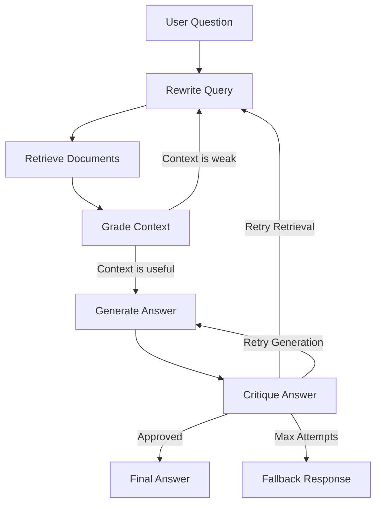

# Self-Healing RAG Pipeline

A Retrieval-Augmented Generation (RAG) system that critiques its own answers and retries when the answer is weak, unsupported, or incomplete.

> Demo video: add your recorded Ollama walkthrough link here.

This project uses LangGraph to model RAG as a stateful workflow:

1. Rewrite the user query.
2. Retrieve relevant document chunks.
3. Grade the retrieved context.
4. Generate a grounded answer.
5. Critique the answer.
6. Retry retrieval or generation if the critic rejects the result.

## Why This Project Matters

Most simple RAG demos stop after one retrieval and one generation step. Real systems need to detect failure, repair themselves, and explain when they cannot answer safely. This project demonstrates:

- Stateful agent workflows with LangGraph
- Retrieval quality checks before generation
- LLM-as-critic answer validation
- Controlled retry loops with max-attempt safeguards
- Grounded answers with source citations
- Evaluation-ready architecture for RAG quality metrics

## Architecture



## Project Status

This repo contains a working MVP for a resume/demo project:

- LangGraph state model
- Critic-driven retry routing
- Routing logic for critic-driven retries
- Local markdown/text document loading
- PDF ingestion with `pypdf`
- Local chunk index for first-pass retrieval
- Optional Chroma vector index with Ollama embeddings
- CLI entry points
- FastAPI API and built-in dashboard
- Optional React frontend
- Ollama support for free local Qwen/Llama demos
- Sample source document
- Roadmap for MVP development

## Tech Stack

- Python
- LangGraph
- LangChain
- ChromaDB
- Ollama for local Qwen/Llama inference
- OpenAI-compatible chat and embedding models
- FastAPI
- RAGAS or DeepEval, planned for evaluation

## Local Setup

```bash
python3 -m venv .venv
source .venv/bin/activate
pip install -e ".[dev]"
cp .env.example .env
```

For a free local demo with Ollama, keep:

```env
LLM_PROVIDER=ollama
OLLAMA_MODEL=qwen2.5:7b-instruct
USE_LLM=true
LLM_FALLBACK_ENABLED=false
```

Then run a local model:

```bash
ollama pull qwen2.5:7b-instruct
ollama pull nomic-embed-text
ollama serve
```

You can also use a Llama model by changing `OLLAMA_MODEL`, for example
`llama3.1:8b`.

For OpenAI-compatible deployment, set `LLM_PROVIDER=openai` and add
`OPENAI_API_KEY` to the environment.

## Usage

```bash
self-healing-rag ingest data/sample_docs
self-healing-rag answer "What makes this RAG pipeline self-healing?"
```

## API

```bash
uvicorn self_healing_rag.api:app --reload
```

```bash
curl -X POST http://127.0.0.1:8000/ingest \
  -H "Content-Type: application/json" \
  -d '{"input_path": "data/sample_docs"}'
```

```bash
curl -X POST http://127.0.0.1:8000/ask \
  -H "Content-Type: application/json" \
  -d '{"question": "What makes this RAG pipeline self-healing?"}'
```

The `/ask` response includes the final answer, sources, critic verdict, attempt count, and workflow trace for the frontend.

Both the CLI and API use `data/index/chunks.jsonl` by default. Pass `--index` to the CLI or `index_path` to `/ask` when using a different local index.

For vector retrieval, set `RETRIEVAL_BACKEND=vector`, pull the configured
embedding model in Ollama, and ingest documents with vector indexing enabled.

## Architecture Docs

See [docs/ARCHITECTURE.md](docs/ARCHITECTURE.md) for runtime flow, component,
and sequence diagrams.

For a resume-friendly walkthrough, see [docs/DEMO_GUIDE.md](docs/DEMO_GUIDE.md).
For the no-paid-API showcase strategy, see
[docs/FREE_TIER_SHOWCASE.md](docs/FREE_TIER_SHOWCASE.md).

## Frontend

The default frontend is served directly by FastAPI and does not require npm:

```bash
uvicorn self_healing_rag.api:app --reload
```

Then open `http://127.0.0.1:8000`.

There is also an optional React, Vite, and TypeScript app in `frontend/`.

```bash
cd frontend
npm install
npm run dev
```

By default, the frontend calls the backend at `http://127.0.0.1:8000`. You can override that with `VITE_API_BASE_URL`.

## Development Checks

```bash
python3 -m compileall src
PYTHONPATH=src python3 -m unittest discover -s tests
```

## Evaluation

Run the lightweight evaluation set:

```bash
self-healing-rag eval --questions data/demo_questions.json
```

The evaluator reports approval rate, citation rate, fallback rate, and average
attempts. This gives a simple baseline before adding RAGAS or DeepEval.

## Resume Pitch

Built a self-healing RAG pipeline using LangGraph, FastAPI, and Ollama/Qwen that
validates generated answers with a critic node and automatically retries
retrieval or generation when responses are unsupported, incomplete, or low
confidence.
