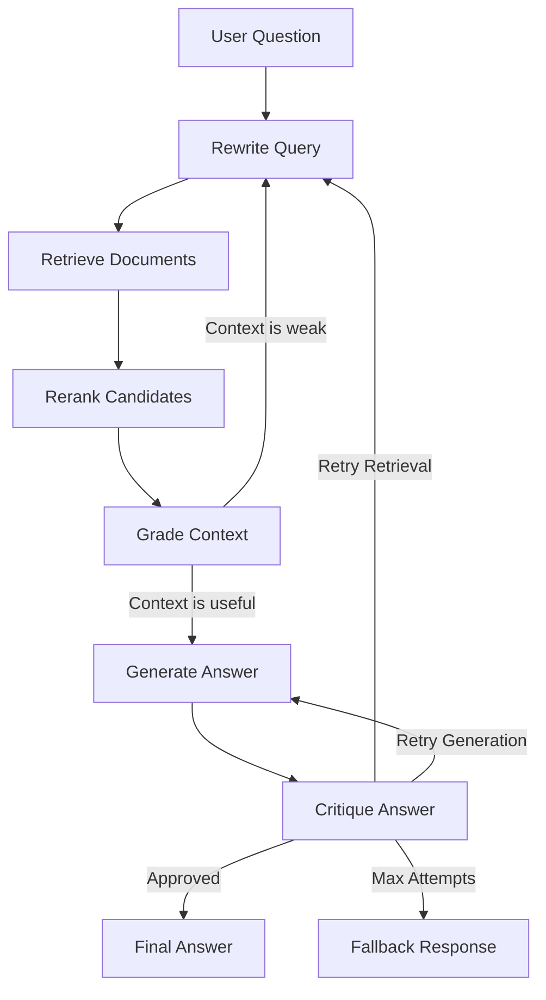

# Self-Healing RAG Pipeline

A Retrieval-Augmented Generation (RAG) system that critiques its own answers and retries when the answer is weak, unsupported, or incomplete.

This project uses LangGraph to model RAG as a stateful workflow:

1. Rewrite the user query.
2. Retrieve relevant document chunks.
3. **Rerank** candidates with a local cross-encoder or LLM scorer.
4. Grade the retrieved context.
5. Generate a grounded answer.
6. Critique the answer.
7. Retry retrieval or generation if the critic rejects the result.
8. **Evaluate** pipeline quality end-to-end with Ragas metrics.

Most simple RAG demos stop after one retrieval and one generation step. Real systems need to detect failure, repair themselves, and explain when they cannot answer safely. This project demonstrates:

- Stateful agent workflows with LangGraph
- Retrieval quality checks before generation
- LLM-as-critic answer validation
- Controlled retry loops with max-attempt safeguards
- Grounded answers with source citations
- **Reranking** — local cross-encoder, LLM scorer, or Cohere API (free trial)
- **Ragas evaluation** — faithfulness, relevance, precision, recall (runs free with Ollama)

## Architecture



## Setup

```bash
# Clone and install (core dependencies)
pip install -e "."

# With reranking support (local cross-encoder + Cohere)
pip install -e ".[rerank]"

# With Ragas evaluation support
pip install -e ".[ragas]"

# All extras
pip install -e ".[dev,ragas,rerank]"
```

Copy and configure your environment:

```bash
copy .env.example .env
```

## Reranking (Free Tiers)

| Backend | How | Cost |
|---|---|---|
| `none` | No reranking | Free |
| `llm` | Ollama LLM scores each chunk | Free (local) |
| `cross-encoder` | `BAAI/bge-reranker-base` via sentence-transformers | Free (local) |
| `cohere` | Cohere Rerank API | Free trial |

```env
# .env — zero-cost local cross-encoder
RERANK_BACKEND=cross-encoder
RERANK_TOP_K=4
RERANK_CANDIDATES_FACTOR=3
```

## Ragas Evaluation (Free Tier)

When `OPENAI_API_KEY` is not set, evaluation runs entirely on your local
Ollama models — no cloud API needed.

```bash
# Via CLI
self-healing-rag eval --questions data/demo_questions.json

# Via API
curl -X POST http://127.0.0.1:8000/evaluate \
  -H "Content-Type: application/json" \
  -d '{"questions_path": "data/demo_questions.json"}'
```

Reports: faithfulness · answer relevance · context precision · context recall ·
approval rate · citation rate · fallback rate · average attempts.

## Tech Stack

- Python
- LangGraph
- LangChain
- ChromaDB
- Ollama (local, free) or OpenAI-compatible models
- FastAPI + React dashboard
- `sentence-transformers` for local cross-encoder reranking
- Ragas for LLM-as-a-judge evaluation

## Docs

- [Architecture](docs/ARCHITECTURE.md) — Mermaid diagrams of workflow and components
- [Free-Tier Showcase](docs/FREE_TIER_SHOWCASE.md) — Reranking and evaluation on zero budget
- [Demo Guide](docs/DEMO_GUIDE.md) — How to record a portfolio walkthrough
