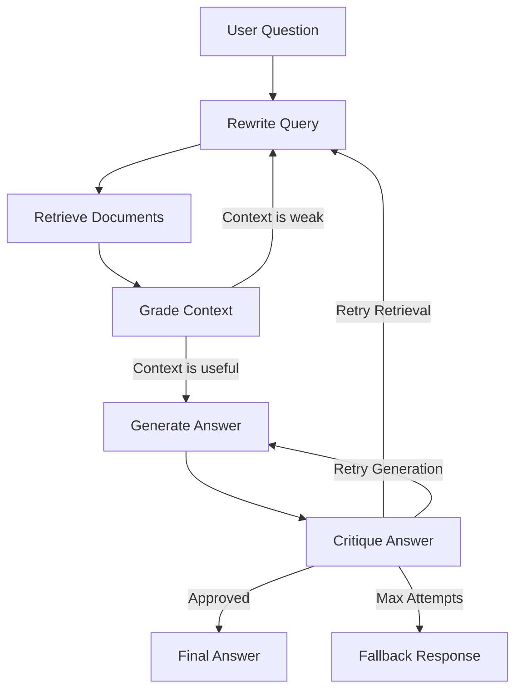

# Self-Healing RAG Pipeline

A Retrieval-Augmented Generation (RAG) system that critiques its own answers and retries when the answer is weak, unsupported, or incomplete.

This project uses LangGraph to model RAG as a stateful workflow:

1. Rewrite the user query.
2. Retrieve relevant document chunks.
3. Grade the retrieved context.
4. Generate a grounded answer.
5. Critique the answer.
6. Retry retrieval or generation if the critic rejects the result.

## Why This Project Matters

Most simple RAG demos stop after one retrieval and one generation step. Real systems need to detect failure, repair themselves, and explain when they cannot answer safely. This project demonstrates:

- Stateful agent workflows with LangGraph
- Retrieval quality checks before generation
- LLM-as-critic answer validation
- Controlled retry loops with max-attempt safeguards
- Grounded answers with source citations
- Evaluation-ready architecture for RAG quality metrics

## Architecture



## Project Status

This repo currently contains the initial project skeleton:

- LangGraph state model
- Workflow node stubs
- Routing logic for critic-driven retries
- CLI entry point placeholder
- Sample source document
- Roadmap for MVP development

## Tech Stack

- Python
- LangGraph
- LangChain
- ChromaDB
- OpenAI-compatible chat and embedding models
- FastAPI, planned for API serving
- RAGAS or DeepEval, planned for evaluation

## Local Setup

```bash
python3 -m venv .venv
source .venv/bin/activate
pip install -e ".[dev]"
cp .env.example .env
```

Then add your API key to `.env`.

## Planned Usage

```bash
self-healing-rag ask "What makes this RAG pipeline self-healing?"
```

## Resume Pitch

Built a self-healing RAG pipeline using LangGraph that validates generated answers with a critic node and automatically retries retrieval or generation when responses are unsupported, incomplete, or low confidence.

