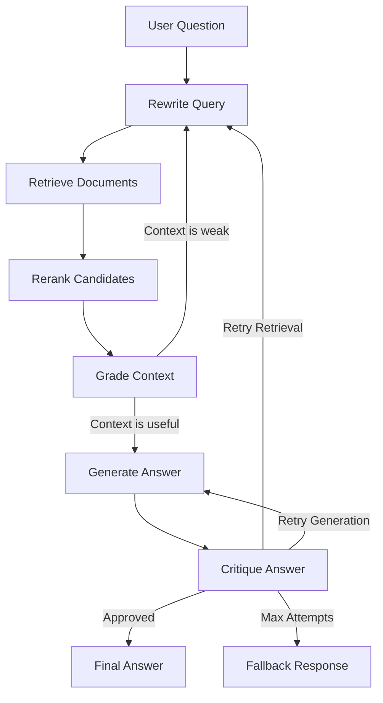

# Self-Healing RAG Pipeline

A Retrieval-Augmented Generation (RAG) system that critiques its own answers and retries when the answer is weak, unsupported, or incomplete.

This project uses LangGraph to model RAG as a stateful workflow:

1. Rewrite the user query.
2. Retrieve relevant document chunks.
3. **Rerank** candidates with a cross-encoder .
4. Grade the retrieved context.
5. Generate a grounded answer.
6. Critique the answer.
7. Retry retrieval or generation if the critic rejects the result.
8. **Evaluate** pipeline quality end-to-end with Ragas metrics.

Most simple RAG demos stop after one retrieval and one generation step. Real systems need to detect failure, repair themselves, and explain when they cannot answer safely. This project demonstrates:

- Stateful agent workflows with LangGraph
- Retrieval quality checks before generation
- LLM-as-critic answer validation
- Controlled retry loops with max-attempt safeguards
- Grounded answers with source citations
- **Reranking** — local cross-encoder, LLM scorer
- **Ragas evaluation** — faithfulness, relevance, precision, recall 

## Architecture

