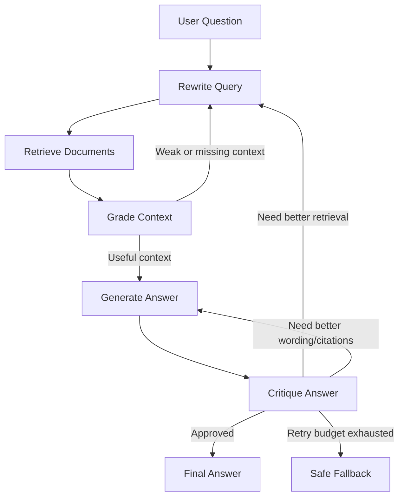
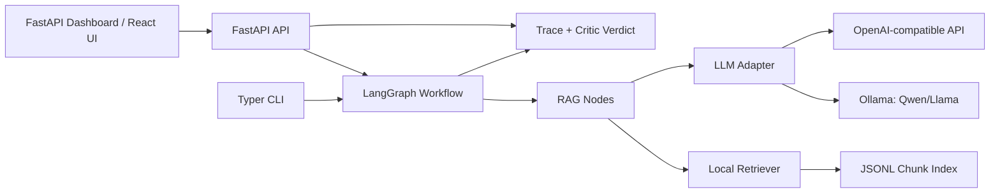
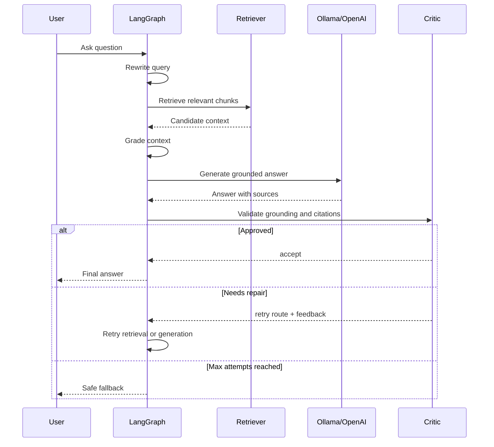

# Architecture

This project is a self-healing Retrieval-Augmented Generation pipeline. It uses
LangGraph to model RAG as a stateful workflow with explicit validation and repair
routes.

## Runtime Flow

## Component Diagram

## Self-Healing Behavior

## Demo Strategy

The project can be showcased without paid API usage:

- Run the backend and model locally with Ollama.
- Use Qwen or Llama for generation and critique.
- Record a short demo video showing ingestion, question answering, critic verdict,
  retry trace, and source citations.
- Deploy the static/project page or repo publicly, while keeping model execution
  local in the recorded demo.
